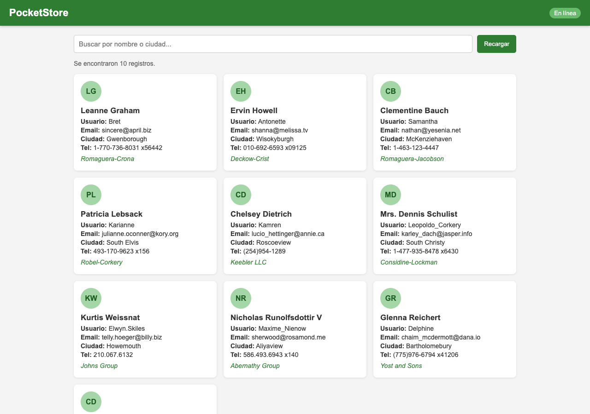
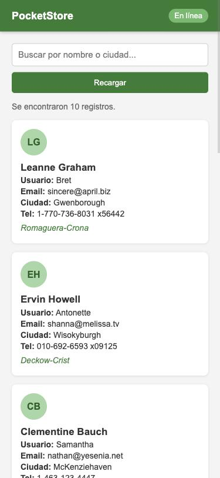

# PocketStore - Catálogo Offline

Aplicación web de una sola página (PWA) hecha con HTML, CSS y JavaScript puro (Vanilla JS). Muestra un catálogo de usuarios obtenido de la API pública [JSONPlaceholder](https://jsonplaceholder.typicode.com/) y sigue funcionando aunque no haya conexión a internet gracias a un Service Worker y la Cache API.

**Modalidad:** individual

## Estructura del proyecto

```
/pocket-store
│
├── index.html         # Vista (App Shell)
├── styles.css         # Estilos del App Shell
├── app.js             # Lógica de la aplicación y registro del SW
├── sw.js              # Service Worker y caché
├── manifest.json      # Manifiesto de instalación
├── icons/             # Iconos de 192x192 y 512x512
└── img/               # Capturas del proceso de desarrollo
```

## ¿Cómo ejecutarlo?

El Service Worker solo funciona en `localhost` o con `https`, entonces no basta con abrir el `index.html` con doble clic. Hay que levantar un servidor local, por ejemplo:

```bash
python3 -m http.server 5500
```

o con la extensión **Live Server** de VS Code. Después abrir `http://localhost:5500`.

## Desarrollo paso a paso

### 1. El Manifiesto (`manifest.json`)

Lo escribí a mano. Tiene el `name`, `short_name`, `start_url`, `display: "standalone"` para que se abra como app sin la barra del navegador, los colores (`theme_color` verde `#2e7d32` y `background_color` gris claro) y dos iconos de 192x192 y 512x512.

### 2. El App Shell (`index.html` y `styles.css`)

La estructura es fija y sencilla:

- **Barra superior** con el título y un indicador de "En línea / Sin conexión".
- **Contenedor principal** con el buscador, un mensaje de estado y la sección `#lista` donde se pintan las tarjetas.
- **Pie de página**.

El HTML y CSS no dependen de la API, así que el cascarón se muestra al instante y el contenido llega después.



En celular las tarjetas pasan a una sola columna y el buscador se acomoda en vertical:



### 3. El Service Worker (`sw.js`)

Se programaron los tres eventos del ciclo de vida:

- **install**: abre la caché `pocketstore-shell-v1` y guarda los archivos del App Shell (`index.html`, `styles.css`, `app.js`, `manifest.json` e iconos).
- **activate**: borra las cachés de versiones anteriores para no dejar basura.
- **fetch**: intercepta las peticiones y usa dos estrategias:
  - **Network First** para la API (`jsonplaceholder.typicode.com`): intenta traer los datos de internet y guarda una copia en `pocketstore-datos-v1`. Si no hay red, responde con lo que haya en caché.
  - **Cache First** para el App Shell: si el archivo ya está en caché lo regresa de ahí, si no lo pide a la red.

### 4. Contenido dinámico (`app.js`)

- Registra el Service Worker.
- Hace `fetch()` a `https://jsonplaceholder.typicode.com/users` y crea una tarjeta por cada usuario (nombre, usuario, email, ciudad, teléfono y empresa).
- Tiene un buscador que filtra por nombre o ciudad.
- Escucha los eventos `online` y `offline` para cambiar el indicador de la barra superior.

## Prueba sin conexión

1. Abrir la app con internet una vez para que se guarde todo en caché.
2. En DevTools → **Application** → **Service Workers**, verificar que el SW esté activo.
3. En **Cache Storage** se ven las dos cachés: `pocketstore-shell-v1` y `pocketstore-datos-v1`.
4. En la pestaña **Network** marcar **Offline** y recargar. La app sigue mostrando el catálogo y el indicador cambia a "Sin conexión".

## Tecnologías

- HTML5
- CSS3 (Flexbox y Grid)
- JavaScript (ES6, `fetch`, `async/await`)
- Service Worker + Cache API
- Web App Manifest
