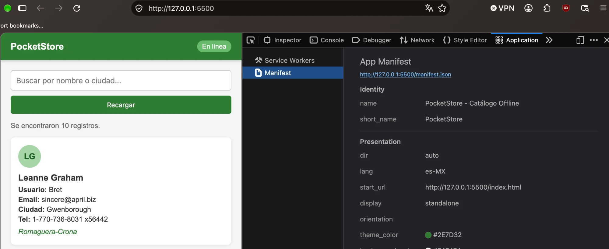
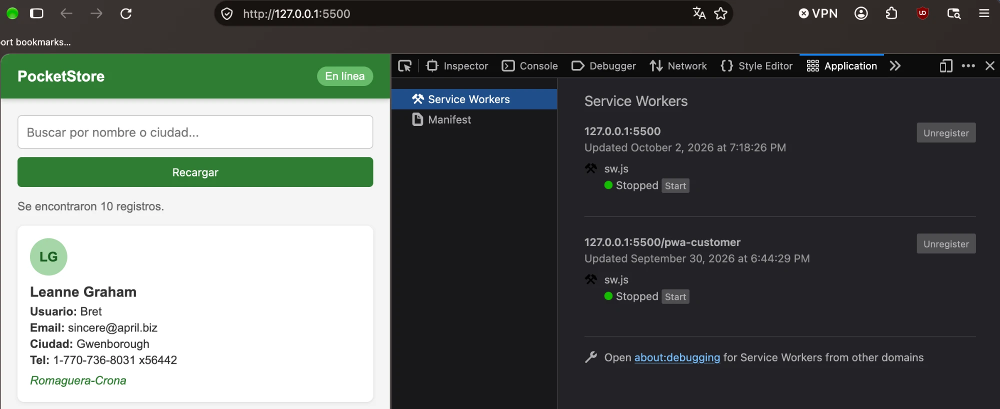
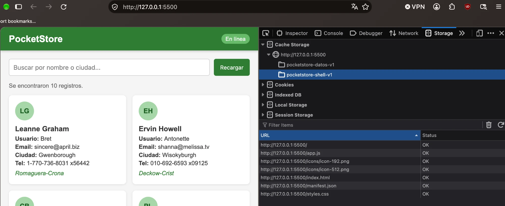
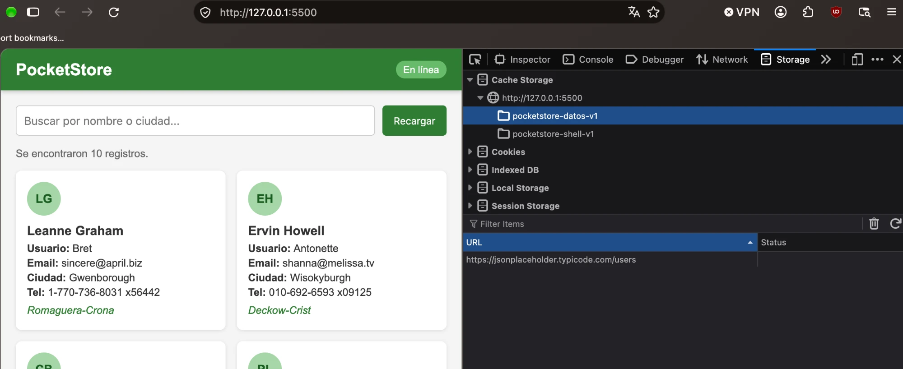
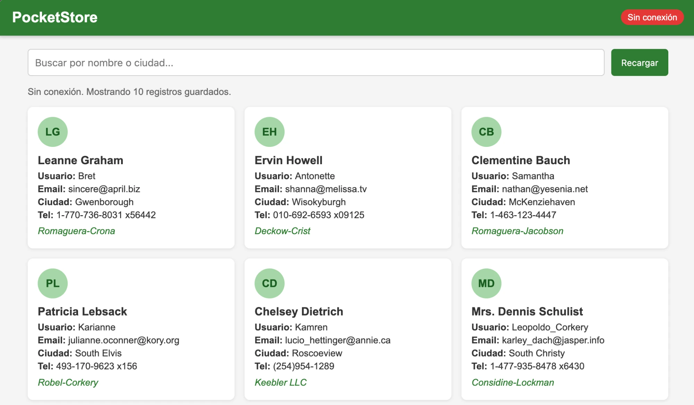
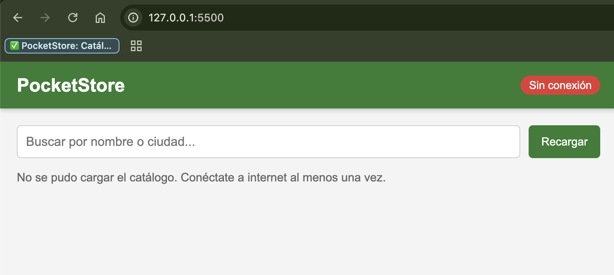
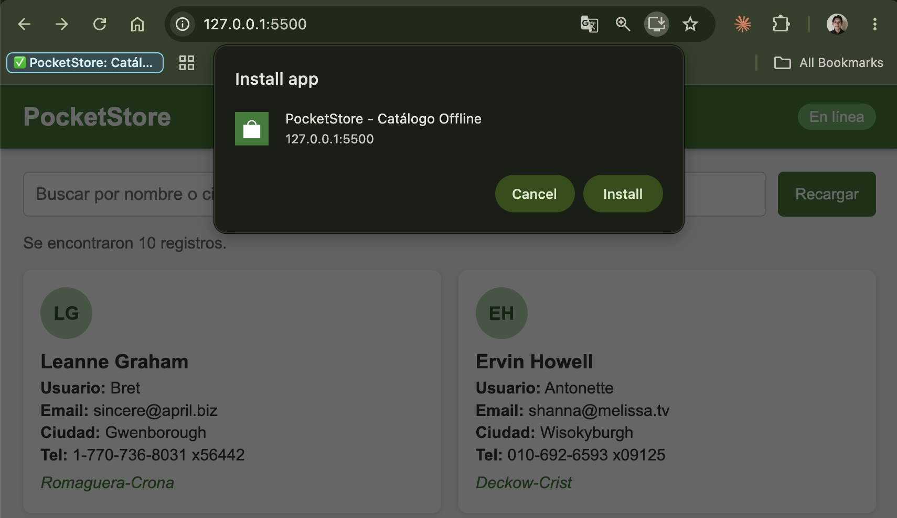
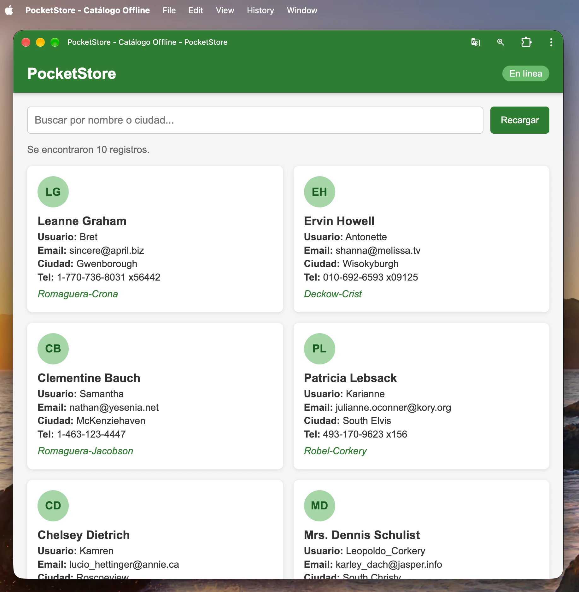

# PocketStore - Catálogo Offline

Aplicación web de una sola página (PWA) hecha con HTML, CSS y JavaScript puro (Vanilla JS). Muestra un catálogo de usuarios obtenido de la API pública [JSONPlaceholder](https://jsonplaceholder.typicode.com/) y sigue funcionando aunque no haya conexión a internet gracias a un Service Worker y la Cache API.

**Modalidad:** individual

## Estructura del proyecto

```
/pocket-store
│
├── index.html         # Vista (App Shell)
├── styles.css         # Estilos del App Shell
├── app.js             # Lógica de la aplicación y registro del SW
├── sw.js              # Service Worker y caché
├── manifest.json      # Manifiesto de instalación
├── icons/             # Iconos de 192x192 y 512x512
└── img/               # Capturas del proceso de desarrollo
```

## ¿Cómo ejecutarlo?

El Service Worker solo funciona en `localhost` o con `https`, entonces no basta con abrir el `index.html` con doble clic. Hay que levantar un servidor local, por ejemplo:

```bash
python3 -m http.server 5500
```

o con la extensión **Live Server** de VS Code. Después abrir `http://localhost:5500`.

## Desarrollo paso a paso

### 1. El Manifiesto (`manifest.json`)

Lo escribí a mano. Tiene el `name`, `short_name`, `start_url`, `display: "standalone"` para que se abra como app sin la barra del navegador, los colores (`theme_color` verde `#2e7d32` y `background_color` gris claro) y dos iconos de 192x192 y 512x512.

En Firefox se puede revisar en DevTools → **Application** → **Manifest**, ahí aparecen los datos que leyó el navegador:



### 2. El App Shell (`index.html` y `styles.css`)

La estructura es fija y sencilla:

- **Barra superior** con el título y un indicador de "En línea / Sin conexión".
- **Contenedor principal** con el buscador, un mensaje de estado y la sección `#lista` donde se pintan las tarjetas.
- **Pie de página**.

El HTML y CSS no dependen de la API, así que el cascarón se muestra al instante y el contenido llega después.


En celular las tarjetas pasan a una sola columna y el buscador se acomoda en vertical:


### 3. El Service Worker (`sw.js`)

Se programaron los tres eventos del ciclo de vida:

- **install**: abre la caché `pocketstore-shell-v1` y guarda los archivos del App Shell (`index.html`, `styles.css`, `app.js`, `manifest.json` e iconos).
- **activate**: borra las cachés de versiones anteriores para no dejar basura.
- **fetch**: intercepta las peticiones y usa dos estrategias:
  - **Network First** para la API (`jsonplaceholder.typicode.com`): intenta traer los datos de internet y guarda una copia en `pocketstore-datos-v1`. Si no hay red, responde con lo que haya en caché.
  - **Cache First** para el App Shell: si el archivo ya está en caché lo regresa de ahí, si no lo pide a la red.

El SW queda registrado para `127.0.0.1:5500` (DevTools → **Application** → **Service Workers**). Aparece como "Stopped" porque el navegador lo duerme cuando no lo está usando y lo vuelve a despertar cuando hay una petición:



En la pestaña **Storage** → **Cache Storage** se ven las dos cachés que crea el SW. En `pocketstore-shell-v1` están todos los archivos del App Shell:



Y en `pocketstore-datos-v1` se guarda la respuesta de la API:



### 4. Contenido dinámico (`app.js`)

- Registra el Service Worker.
- Hace `fetch()` a `https://jsonplaceholder.typicode.com/users` y crea una tarjeta por cada usuario (nombre, usuario, email, ciudad, teléfono y empresa).
- Tiene un buscador que filtra por nombre o ciudad.
- Escucha los eventos `online` y `offline` para cambiar el indicador de la barra superior.

## Prueba sin conexión

1. Abrir la app con internet una vez para que se guarde todo en caché.
2. En DevTools → **Application** → **Service Workers**, verificar que el SW esté registrado.
3. En **Storage** → **Cache Storage** revisar que existan `pocketstore-shell-v1` y `pocketstore-datos-v1`.
4. Quitar la conexión. En Firefox: menú **File** → **Work Offline** (o en DevTools → **Network**, en el menú de "No Throttling" elegir **Offline**).
5. Recargar la página. La app sigue mostrando el catálogo y el indicador cambia a "Sin conexión".



### Sin conexión y sin datos guardados

También probé qué pasa si el App Shell está en caché pero los datos de la API no. Para eso borré `pocketstore-datos-v1`, puse la red en **Offline** y recargué. La app carga igual (el shell sale de la caché) y muestra un mensaje de error en lugar de quedarse en blanco:



Cosas que encontré haciendo esta prueba:

- En Firefox los datos seguían apareciendo aunque borrara la caché. Era porque JSONPlaceholder manda `Cache-Control: max-age=43200` y el navegador tenía la respuesta en su **caché HTTP**, entonces el `fetch()` del SW "funcionaba" aunque no hubiera red. Se soluciona marcando **Disable Cache** en la pestaña Network.
- En Chrome, al usar **Offline** desde DevTools, `navigator.onLine` seguía en `true` después de recargar y el indicador decía "En línea". Por eso en `app.js` también se marca "Sin conexión" cuando el `fetch` falla.

## Instalación

Como la app tiene manifiesto y Service Worker, Chrome muestra el botón para instalarla en la barra de direcciones:



Ya instalada se abre en su propia ventana, sin la barra del navegador, por el `display: "standalone"` del manifiesto:



## Tecnologías

- HTML5
- CSS3 (Flexbox y Grid)
- JavaScript (ES6, `fetch`, `async/await`)
- Service Worker + Cache API
- Web App Manifest
